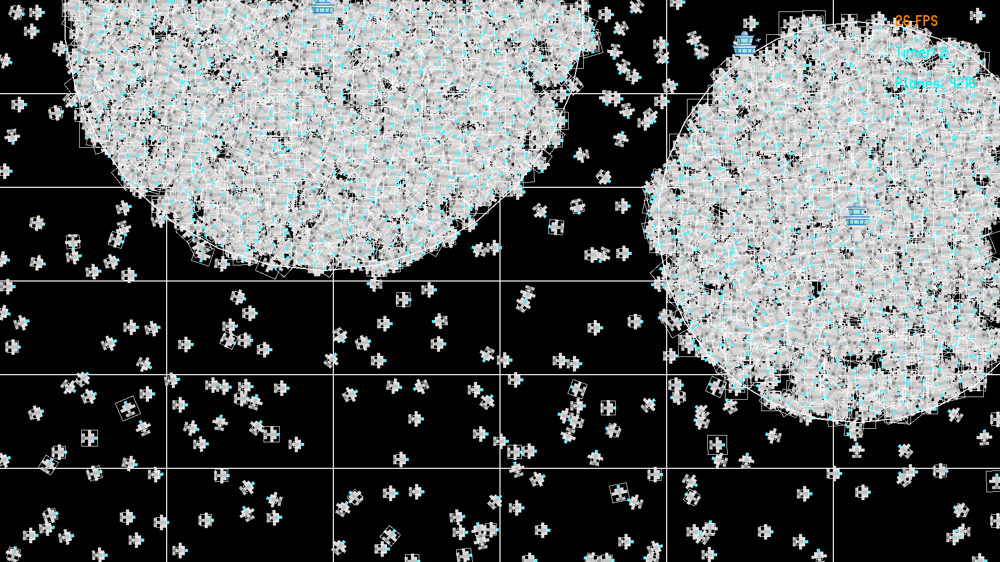

# Epitech my_radar project

### Goals

1. Optimisation: being able to display thousands of sprites on screen, and calculating their position, movement and collisions on every frame.
2. Collisions: being able to precisely detect collisions between two sprites that are not the same shape, size or orientation.
3. Parsing: being able to detect as much errors as possible in the given file, and then extracting the data efficiently.

Example:

### How the project works

The file given as argument will be opened and used to determine how much planes to display, their position, their arrival coordinates, and their delay (time in seconds before take off).  
The file also gives coordinates to control towers, and their effect radius. If a plane is contained within the tower radius, it doesn't collide with other planes.

### Optimisation

The first thing you want to do in order to have better performance is reduce texture quality. By doing so, the computer needs much less time to draw all planes on the screen.  
As you can imagine, the absolute worst part in the optimisation is the fact that when planes are in a control tower's area, they don't disappear, and this results in terrible performance when having thousands of planes to display, simply because
of how much planes the computer has to render.  
This part was optimised by first testing if a plane is in a control tower's area, before testing its collision with other planes.  
The last problem was collisions. If I tested the collisions of each plane with every other plane that isn't in a control tower's radius, it take a really long time, knowing that collisions will be tested even with two planes that are in opposite corners of the screen.  
I dealt with this problem using boxes (visible on the image). On every frame, every plane that isn't contained in a control tower's radius is put in one or more boxes depending on its position. Collisions will only be tested with planes in the same box, which greatly improves performance.

